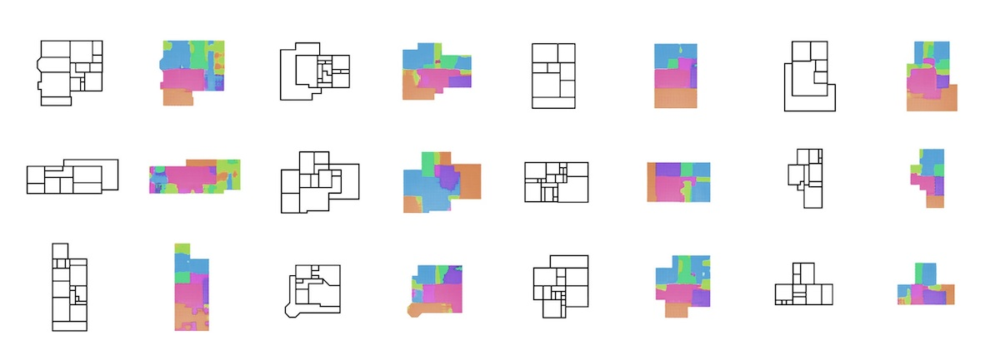

# pix2pix-floorplans-dataset

This repository contains all of code necessary to retrain a pix2pix model on new image pairs, and export a checkpoint in a format that can be uploaded to RunwayML. I've also included the Rhino/Grasshopper workflow files that I used to export the original source images.

This is a companion to the [`pix2pix-runway`](https://github.com/nonoesp/pix2pix-runway) repo, which uses the RunwayML SDK to serve the model inside of the Runway app.

### About the data:

The dataset is derived from images of floor plans for small, single-story houses sourced from HousePlans.com. Each image was manually tagged using Rhino and Grasshopper, and exported as an A/B image pair for use with pix2pix. The A image contains the boundary shape of each floor plan represented as a solid black region. The B image contains the same boundary, but with color coded regions that correspond to different room types in the plan.

### Organization of the `/dataset` directory:

This directory contains the images that we'll use to train a pix2pix model.
`Source Images`: These are the source images that informed the room tags.  
`Original`: 
- `/A`: The boundary shape of each floor plan represented as a solid black region
- `/B`: The color tagged plans
